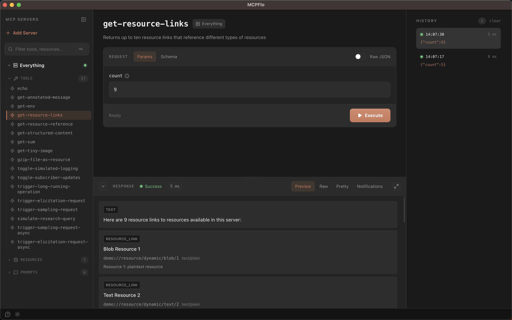

<p align="center">
  
</p>

<h1 align="center">MCPFlo</h1>

<p align="center">
  <strong>A visual testing tool for MCP (Model Context Protocol) servers.</strong><br/>
  Think Postman, but for MCP.
</p>

<p align="center">
  
</p>

MCPFlo is a desktop app for testing MCP servers by hand. Connect to one or more
servers, browse the tools, resources, and prompts they expose, and invoke them
with real inputs — then inspect the exact response that came back. It's built for
developers writing or integrating MCP servers who want to see what a capability
actually does without wiring it into an AI client first.

---

## Why

When you're building an MCP server, the hard part isn't writing the tool — it's
checking that it behaves. Your options today are limited:

- Hand-write a throwaway script that spins up a client and calls the tool
- Drop the server into an AI client like Claude Desktop and hope the model calls
  the tool the way you intended, with no clear view of what it sent or received

Both are slow and opaque. MCPFlo gives you a direct, deterministic way to call a
single tool, read a resource, or render a prompt — with the raw request and
response in front of you, no model in the loop, no tokens spent.

---

## Features

Everything below is implemented and working today.

- **Multiple simultaneous servers.** Connect to as many servers as you want and
  browse them side by side. Each runs over its own pooled connection.
- **stdio and Streamable HTTP transports.** Spawn a local server over stdio, or
  connect to a remote one over Streamable HTTP. HTTP connections support custom
  request headers (e.g. an `Authorization: Bearer …` token) for token-authed
  servers.
- **OAuth 2.1 for Streamable HTTP.** Sign in to OAuth-protected servers with the
  authorization-code + PKCE flow: MCPFlo opens your system browser, captures the
  redirect on a loopback listener (RFC 8252), and reconnects. Clients register
  automatically via Dynamic Client Registration, with a manual Client ID fallback
  when a server doesn't support it. Tokens are encrypted at rest using the OS
  keychain (`safeStorage`), and static custom headers still work alongside OAuth.
- **Browse capabilities.** View every tool, resource, and prompt across all
  connected servers in a grouped tree.
- **Unified filter.** A single search box (⌘K) filters tools, resources, and
  prompts across every server at once.
- **Schema-driven parameter forms.** Tool inputs render as a form generated from
  the tool's JSON Schema, powered by [react-jsonschema-form](https://rjsf-team.github.io/react-jsonschema-form/).
  Nested objects and arrays are supported, with add/remove controls and
  client-side validation before the call goes out.
- **Tool execution with rich response rendering.** Invoke a tool and inspect the
  result. Content blocks render by type — text, pretty-printed JSON, images,
  audio, and embedded/linked resources — and mixed content (multiple blocks of
  different types in one response) renders inline. The full JSON-RPC envelope is
  available as a raw view.
- **Resource reading and prompt rendering.** Read a resource and view its text or
  binary contents; render a prompt with named arguments and see the expanded
  message turns.
- **Live notifications.** Progress notifications and log messages emitted by a
  server while a tool call is in flight are captured and shown in a notifications
  tab alongside the call.
- **Elicitation.** When a tool asks the user for input mid-call
  (`elicitation/create`), MCPFlo renders the requested schema as a form and sends
  your answer back. Form-mode elicitation is supported; URL-mode is not.
- **Sampling.** When a server asks the client to run an LLM completion
  (`sampling/createMessage`), MCPFlo prompts *you* to answer by hand instead of
  calling a model — keeping every interaction deterministic and token-free.
- **Call history.** Each tool, resource, and prompt keeps a per-capability
  history of recent calls (up to 50 each) that you can revisit during a session.
  History is in-memory only and **does not persist across app restarts.**
- **Light and dark themes.**

### Not supported

These are deliberate limitations, called out so there are no surprises:

- **No SSE transport.** Only stdio and Streamable HTTP are supported. The
  deprecated HTTP+SSE transport is intentionally omitted.
- **History does not persist.** Call history is cleared when the app closes.
- **macOS releases are Apple Silicon (arm64) only**, and binaries are **unsigned
  and not notarized** (see install note below).

---

## Installation

### Prerequisites

- Node.js 18+
- npm 9+

### From source

```bash
git clone https://github.com/harshalslimaye/mcpflo.git
cd mcpflo
npm install
npm run dev
```

### Installing a downloaded build (macOS)

MCPFlo's macOS builds aren't signed with an Apple Developer ID or notarized, so
the first time you open one Gatekeeper will warn that the app "can't be opened" or
is from an unidentified developer. This is expected — clear it once and macOS
remembers:

1. In Finder, **right-click** (or Control-click) **MCPFlo.app → Open**.
2. Click **Open** in the dialog.

After that, MCPFlo launches normally on every subsequent run.

If you prefer the terminal, you can strip the quarantine flag instead:

```bash
xattr -dr com.apple.quarantine /Applications/MCPFlo.app
```

> If the app ever fails to launch with a *"different Team IDs"* error, the bundle
> was modified after download (for example a partially applied update). Reinstall
> a fresh copy from the latest release rather than re-signing it in place.

---

## Add your first server

A fresh install is seeded with the MCP reference
[`@modelcontextprotocol/server-everything`](https://github.com/modelcontextprotocol/servers/tree/main/src/everything)
server, which exercises every capability MCPFlo supports — a good place to start.
To add your own:

1. Click **+ Add Server** in the sidebar.
2. Enter a name and choose a transport:
   - **stdio** — provide the command and args (e.g. `npx` with args
     `-y @modelcontextprotocol/server-memory`), plus any environment variables.
   - **Streamable HTTP** — provide the URL, plus any request headers
     (e.g. `Authorization=Bearer …`).
3. Click **Add Server**.
4. Expand the server row — MCPFlo connects and discovers all tools, resources,
   and prompts automatically.

Server configs are persisted with [electron-store](https://github.com/sindresorhus/electron-store)
to `config.json` under the app's user-data directory:

- macOS: `~/Library/Application Support/MCPFlo/config.json`
- Windows: `%APPDATA%/MCPFlo/config.json`
- Linux: `~/.config/MCPFlo/config.json`

Discovered capabilities are cached to disk per server under
`<user-data>/servers/<server-id>/capabilities.json`, so they're available
immediately on the next launch before a fresh fetch runs.

---

## Tech stack

- [Electron](https://www.electronjs.org/) + [electron-vite](https://electron-vite.org/)
- [React](https://react.dev/) 19 + [TypeScript](https://www.typescriptlang.org/)
- [Tailwind CSS v4](https://tailwindcss.com/)
- [@modelcontextprotocol/sdk](https://github.com/modelcontextprotocol/typescript-sdk) for the MCP client and transports
- [react-jsonschema-form (RJSF)](https://rjsf-team.github.io/react-jsonschema-form/) for schema-driven parameter forms
- [Zustand](https://zustand-demo.pmnd.rs/) for state
- [electron-store](https://github.com/sindresorhus/electron-store) for config persistence
- [Vitest](https://vitest.dev/) + [Testing Library](https://testing-library.com/) for tests

---

## Development

```bash
npm run dev         # run the app in development
npm test            # run the test suite once
npm run test:watch  # run tests in watch mode
npm run typecheck   # type-check main and renderer
npm run lint        # lint with ESLint
npm run format      # format with Prettier
```

`npm install` sets up Husky hooks; `git push` runs `npm test` via the `pre-push` hook.

### Project structure

```
src/
├── main/        Electron main process — IPC, MCP client, persistence, caching
├── preload/     Typed bridge between main and renderer
├── renderer/    React UI (sidebar, detail views, stores, RJSF forms)
└── shared/      Types shared across processes (MCP schemas, configs)
```

### Build

```bash
npm run build:mac     # macOS (dmg, arm64)
npm run build:win     # Windows (nsis, x64 + arm64)
npm run build:linux   # Linux
```

---

## Contributing

Contributions are welcome. Open an issue to discuss a change or file a bug at the
[issue tracker](https://github.com/harshalslimaye/mcpflo/issues), and send a pull
request.

---

## License

MIT — free to use, modify, and distribute.
